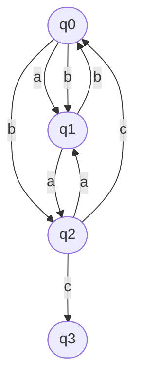
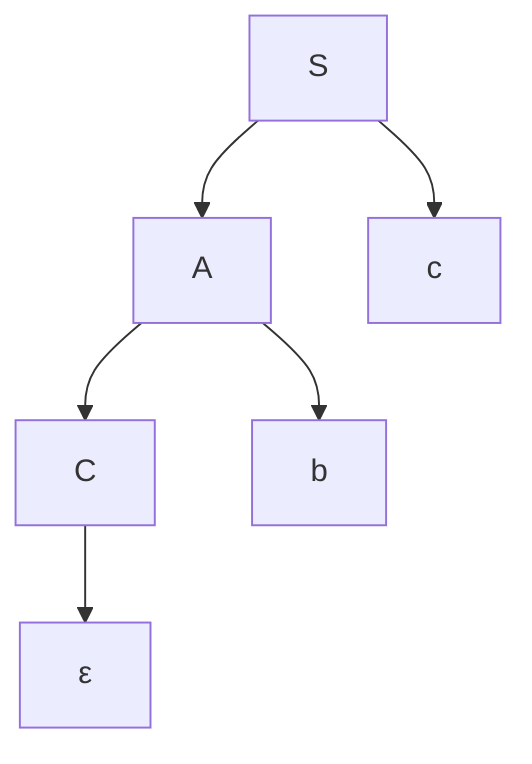
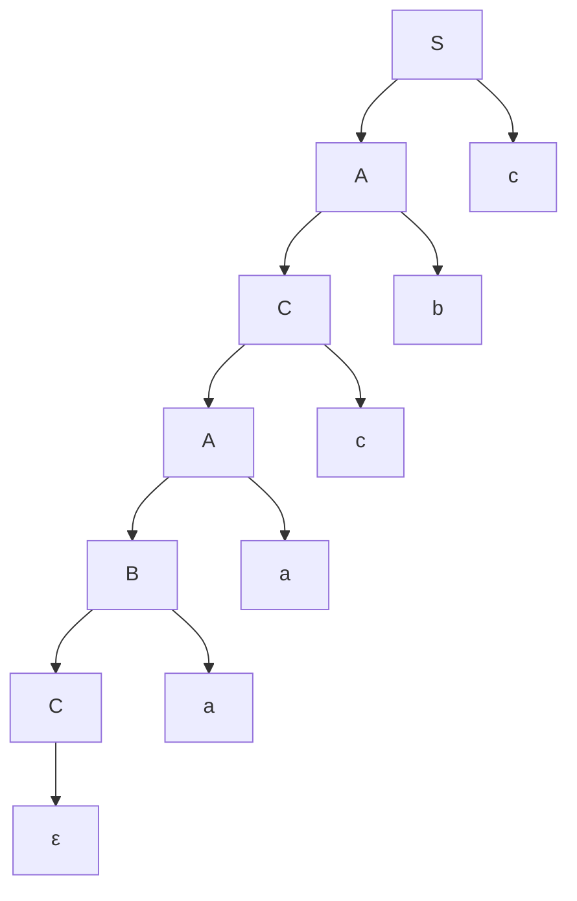
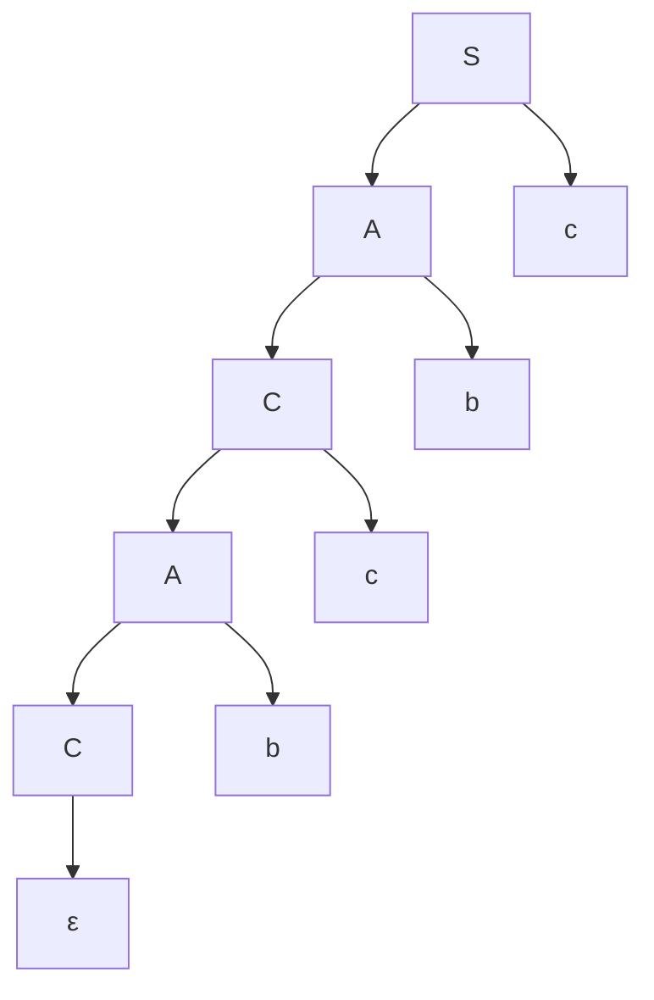
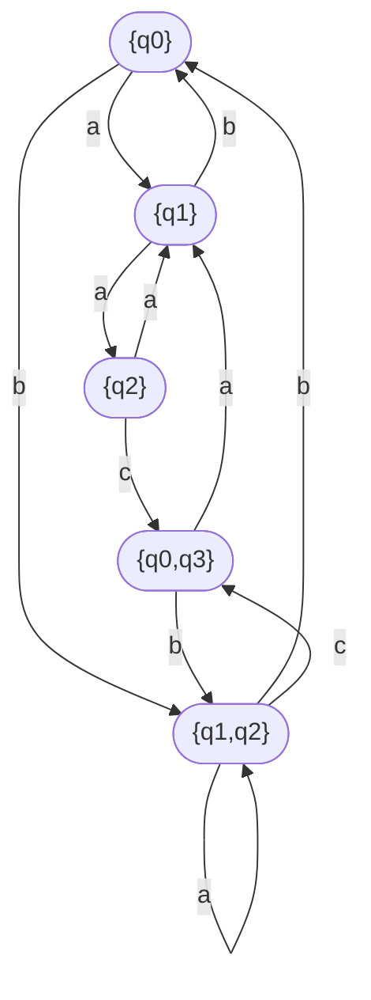

# Laborator 1 la Limbaje formale și automate

A elaborat: **Curmanschii Anton, IA1901.**

Tema: **Automate Finite.**

**Varianta 6.**

Automatul finit: $ 
AF = (Q, \Sigma, \delta, q_0, F), \\\\
Q = \\{ q_0, q_1, q_2, q_3 \\},   \\\\
\Sigma = \\{ a, b, c \\},         \\\\
F = \\{ q_3 \\},                  \\\\
\delta(q_0, a) =\\{ q_1 \\},  \delta(q_0, b) = \\{ q_1, q_2 \\}, \\\\ 
\delta(q_1, b) = \\{ q_0 \\}, \delta(q_1, a) = \\{ q_2 \\},      \\\\
\delta(q_2, a) = \\{ q_1 \\}, \delta(q_2, c) = \\{ q_3, q_0 \\}. 
$

## Sarcini și Răspunsuri

> 1\. Să se reprezinte automatul finit în formă tabelară și grafică.

|       | **a** | **b**      | **c**      |
|-------|-------|------------|------------|
| $q_0$ | $q_1$ | $q_1, q_2$ | error      |
| $q_1$ | $q_2$ | $q_0$      | error      |
| $q_2$ | $q_1$ | error      | $q_3, q_0$ |

Am făcut și un tabel transpus (mai ușor de utilizat în unele cazuri, după opinia mea).

|       | $q_0$      | $q_1$ | $q_2$      |
|-------|------------|-------|------------|
| **a** | $q_1$      | $q_2$ | $q_1$      |
| **b** | $q_1, q_2$ | $q_0$ | error      |
| **c** | error      | error | $q_3, q_0$ |

Urmează graful. Starea $q_0$ este starea inițială, iar $q_3$ — cea terminală.

> 2\. Pentru 5 cuvinte (3 corecte și 2 incorecte) să se demonstreze printr-un calcul de configurații acceptarea sau neacceptarea cuvintelor.

1. **abc**

$ q_0 \xrightarrow{a} q_1 \xrightarrow{b} q_0 \xrightarrow{c} ?? $

Cuvântul nu este acceptat, deoarece configurația $(q_0, c)$ nu este acceptată (după definiție).

Mai formal, lanțul mea de mai sus se scrie astfel, și se numește *istoria computației* ([sursa](https://en.wikiversity.org/wiki/Automata_theory/Finite_automata#Computation)):

$ (q_0, abc) \vdash (q_1, bc) \vdash (q_0, c) $

Așa că $ q_0 \neq q_3 $, iar $ c \neq \varepsilon $, cuvântul nu este acceptat.

2. **bc**

Computația potențială $ (q_0, bc) \vdash (q_1, c) $ nu ne aduce la configurația $ (q_3, \varepsilon) $, deci nu este acceptată.
Aici am încercat tranziția $ (q_0, bc) \vdash (q_1, c) $, dar mai avem o posibilitate, $ (q_0, bc) \vdash (q_2, c) $.

Dacă folosim această tranziție, obținem istoria computațională $ (q_0, bc) \vdash (q_2, c) \vdash (q_3, \varepsilon) $.
Având în vedere că starea $q_3$ este starea terminală, cuvântul **bc** este acceptat.

S-ar putea considera și computația $ (q_2, c) \vdash (q_0, \varepsilon) $.
Această posibilitate însă există doar deoarece automatul este nedeterminist (cel puțin în forma dată), și în acest caz posibilitatea dată nu ne interesează, deoarece nu ne aduce la configurația $ (q_3, \varepsilon) $.

3. $ \varepsilon $

$ q_0 \neq q_3 $, deci cuvântul nu este acceptat.

4. $ bcbc $

$ (q_0, bcbc) \vdash (q_2, cbc) \vdash (q_0, bc) \vdash (q_2, c) \vdash (q_3, \varepsilon) $, cuvântul este acceptat.

5. $ c $

$ (q_0, c) $ oprește automatul finit, cuvântul nu este acceptat.

6. $ aacbc $

$ (q_0, aacbc) \vdash (q_1, acbc) \vdash (q_2, cbc) \vdash (q_0, bc) \vdash (q_2, c) \vdash (q_3, \varepsilon) $, cuvântul este acceptat.

> 3\. Să se construiască gramatica regulată echivalentă.

$ G = (V_T, V_N, P, S) $

$ V_T = \\{ a, b, c, \varepsilon \\} $

$ V_N = \\{ S, A, B, C \\} $

$ S = N $

$ P =
\begin{cases}
S \rightarrow Ac \\\\
A \rightarrow Cb|Ba \\\\
B \rightarrow Aa|Ca|Cb \\\\
C \rightarrow \varepsilon|Bb|Ac \\\\
\end{cases}
$

Explic cum am procedat pentru a genera $ P $.
Deci, scopul este de a ajunge de la $q_0$ la $q_1$ (a construi un lanț în graful de mai sus de la $q_0$ la $q_1$).
Litera finală care vă aduce de la $q_2$ la $q_3$ este $c$, iar celelalte combinații de litere care să vă aducă de la $q_0$ la $q_2$ (într-un oarecare mod, nu necesar direct), le numim regula $A$. 
Astfel, regula unui cuvând este $S \rightarrow Ac$.

Asemănător ne gândim și la $A$: ce secvențe de litere ne aduc de la $q_0$ la $q_2$? Este ori $b$, atunci sărim de la $q_0$ la $q_2$ direct, ori litera $a$ din starea $q_1$. 
Definim posibilitățile de a ajunge la $q_1$ de la $q_0$ ca $B$, și procedăm asemănător și cu $B$.
Regula $C$ deci va fi toate lanțurile ce se duc de la $q_0$ la $q_0$. 
De aceea avem aici și cuvântul epsilon (deoarece începem de la $q_0$), dar avem și alte reguli care se duc la $q_0$ de la celelalte stări.

> 4\. Pentru două cuvinte acceptate de automatul finit, să se demonstreze printr-un calcul de derivări generarea  acestor cuvinte şi de gramatica regulată.

1. **bc**

$
S \xrightarrow{S \rightarrow Ac} Ac \\\\
Ac \xrightarrow{A \rightarrow Cb} Cbc \\\\
Cbc \xrightarrow{C \rightarrow \varepsilon} bc \\\\
$

2. **aacbc**

$
S \xrightarrow{S \rightarrow Ac} Ac \\\\
Ac \xrightarrow{A \rightarrow Cb} Cbc \\\\
Cbc \xrightarrow{C \rightarrow Ac} Acbc \\\\
Acbc \xrightarrow{A \rightarrow Ba} Bacbc \\\\
Bacbc \xrightarrow{C \rightarrow Ca} Cacbc \\\\
Cacbc \xrightarrow{C \rightarrow \varepsilon} aacbc \\\\
$

3. **bcbc**

$
S \xrightarrow{S \rightarrow Ac} Ac \\\\
Ac \xrightarrow{A \rightarrow Cb} Cbc \\\\
Cbc \xrightarrow{C \rightarrow Ac} Acbc \\\\
Acbc \xrightarrow{A \rightarrow Cb} Cbcbc \\\\
Cbcbc \xrightarrow{C \rightarrow \varepsilon} bcbc \\\\
$

> 5\. Să se construiască arborele de derivare pentru fiecare din cuvinte. 

1. **bc**

2. **aacbc**

3. **bcbc**

> 6\. Construiţi automatul finit determinist echivalent.

[Despre automate nedeterministe](https://www.wikiwand.com/en/Nondeterministic_finite_automaton).

Un automat este nedeterminist, în comparația cu un automat determinist, dacă există cel puțin o stare care are mai multe tranziții pentru același simbol (de exemplu, $ q_0 \xrightarrow{b} q_1 $ și $ q_0 \xrightarrow{b} q_2 $). Aș putea scrie aceasta și formal, dar notații vor fi cam prea complexe pentru așa idee simplă.

Putem folosi algoritmul [**powerset construction**](https://www.wikiwand.com/en/Powerset_construction) pentru a converta un automat nedeterminist în unul determinist.
Ideea algorimului este, neformal, de a urmări toate variantele tranzițiilor posibile (deci ambii $ q_0 \xrightarrow{b} q_1 $ și $ q_0 \xrightarrow{b} q_2 $), incapsulându-le în unele stări noi definite.

Deci algoritmul este următorul:

1. Colapsăm stărea inițială cu toate stările accesibile după tranziții $ \varepsilon $ într-o singură mulțime. În cazul nostru, $ q_0 $ nu are vecini accesibile după tranziții $ \varepsilon $, deci mulțimea inițială $ q ^ { \prime } _ { 0 } = \\{ q_0 \\} $. Această mulțime o considerăm ca starea inițială a noului automat.

2. Pentru fiecare stare din graful nou, $ q ^ { \prime } _ { i } $, conectăm $ q ^ { \prime } _ { i } $ cu $ q ^ { \prime } _ { j } $ cu tranziția după simbolul $ x \in \Sigma $, creând acest $ q ^ { \prime } _ { j } $ dacă nu există deja în automatul nou, după regula că $ q ^ { \prime } _ { j } $ va conține toate stările din automatul inițial (nenormalizat) care pot fi atinse din cel puțin o stare $ q_n $ din $ q ^ { \prime } _ { i } $ prin intermediul tranziției $ x $ în automatul inițial. În alte cuvinte, $ q_m \in q ^ { \prime } _ { j } \iff \exists q_n \in q ^ { \prime } _ { i } \mid q_m \in \delta(q_n, x) $. În alte cuvinte, $ q ^ { \prime } _ { j } $ va conține uniunea mulțimelor $ \delta(q_n, x), \forall q_n \in q ^ { \prime } _ { i } $. Important, $ q ^ { \prime } _ { j } $ este nevid.

3. Repetăm pasul 2 pentru stările nou adăugate până când nu obținem nici o stare nouă.

De exemplu, în cazul nostru, avem starea în automatul nou $ q ^ { \prime } _ { 0 } $, ce conține doar $ q_0 $.
Încercăm să aplicăm tranzițiile pentru fiecare simbol $ x $ din $ \Sigma $, deci:
- $ x = a $. Ce stările conține $ \delta(q_0, a) $? $ q_1 $. Deci, $ q ^ { \prime } _ { 1 } = \\{ q_1 \\} $ o stare nouă în automatul nou.
- Aplicăm aceeași logică pentru $ x = b $, obținând starea $ q ^ { \prime } _ { 2 } = \\{ q_1, q_2 \\} $. Verificarea lui $ x = c $ ne dă o stare vidă, deci nu o luăm în considerare.
- Acum repetăm algoritmul pentru nodurile $ q ^ { \prime } _ { 1 } $ și $ q ^ { \prime } _ { 2 } $ nou adăugate. Pentru $ q ^ { \prime } _ { 1 } $ încercăm $ x = a $, obținând starea $ q ^ { \prime } _ { 3 } = \\{ q_2 \\} $, încercăm $ x = b $, obținând starea $ q ^ { \prime } _ { 0 } $, încercăm $ x = c $, obținând o mulțime vidă.
- Trecem la $ q ^ { \prime } _ { 2 } = \\{ q_1, q_2 \\} $. Încercăm $ x = a $. Deoarece $ q ^ { \prime } _ { 2 } $ conține cele două stări $ q_1 $ și $ q_2 $, $ q ^ { \prime } _ { j } = \delta(q_1, a) \cup \delta(q_2, a) = \\{ q_2 \\} \cup \\{ q_1 \\} = \\{ q_1, q_2 \\} = q ^ { \prime } _ { 2 } $. 
- Pentru $ x = b $ obținem din nou $ q ^ { \prime } _ { 0 } $.
- Încercăm $ x = c $. $ q ^ { \prime } _ { j } = \delta(q_1, c) \cup \delta(q_2, c) = \\{ \\} \cup \\{ q_0, q_3 \\} = \\{ q_0, q_3 \\} = q ^ { \prime } _ { 2 } $.
- Asemănător procedăm și cu celelalte stări nou adăugate.

S-a obținut:
$ 
{AF}^\prime = (Q ^ { \prime }, \Sigma ^ { \prime }, \delta ^ { \prime }, q ^ { \prime } _ { 0 }, F ^ { \prime }),     \\\\
Q ^ { \prime } = \\{ q ^ { \prime } _ { 0 }, q ^ { \prime } _ { 1 }, q ^ { \prime } _ { 2 }, q ^ { \prime } _ { 3 }, q ^ { \prime } _ { 4 } \\}, \\\\
q ^ { \prime } _ { 0 } = \\{ q_0 \\} \\\\
q ^ { \prime } _ { 1 } = \\{ q_1 \\} \\\\
q ^ { \prime } _ { 2 } = \\{ q_2 \\} \\\\
q ^ { \prime } _ { 3 } = \\{ q_1, q_2 \\} \\\\
q ^ { \prime } _ { 4 } = \\{ q_0, q_3 \\} \\\\
\Sigma ^ { \prime } = \\{ a, b, c \\},         \\\\
F ^ { \prime } = \\{ q ^ { \prime } _ { 4 } \\},                  \\\\
\delta^ { \prime }(q ^ { \prime } _ { 0 }, a) =\\{ q ^ { \prime } _ { 1 } \\},  \delta(q ^ { \prime } _ { 0 }, b) = \\{ q ^ { \prime } _ { 3 } \\}, \\\\ 
\delta^ { \prime }(q ^ { \prime } _ { 1 }, b) = \\{ q ^ { \prime } _ { 0 } \\}, \delta(q ^ { \prime } _ { 1 }, a) = \\{ q  ^ { \prime } _ 2 \\}, \\\\
\delta^ { \prime }(q ^ { \prime } _ { 2 }, a) = \\{ q ^ { \prime } _ { 1 } \\}, \delta(q ^ { \prime } _ { 2 }, c) = \\{ q ^ { \prime } _ { 4 } \\}, \\\\
\delta^ { \prime }(q ^ { \prime } _ { 3 }, a) = \\{ q ^ { \prime } _ { 3 } \\}, \delta(q ^ { \prime } _ { 3 }, b) = \\{ q ^ { \prime } _ { 0 } \\}, \delta(q ^ { \prime } _ { 3 }, c) = \\{ q ^ { \prime } _ { 4 } \\}, \\\\
\delta^ { \prime }(q ^ { \prime } _ { 4 }, a) = \\{ q ^ { \prime } _ { 1 } \\}, \delta(q ^ { \prime } _ { 4 }, b) = \\{ q ^ { \prime } _ { 3 } \\}, \\\\
$

> 7\. Reprezentați automatul finit determinist în formă grafică.

Nu pot marca pe diagrama stările finale cu cerculețele duble, deci voi menționa așa.
Starea inițială este $ \\{ q _ 0 \\} $, starea terminală este $ \\{ q_0, q_3 \\} $.

> 8\. Pentru două cuvinte acceptate de automatul finit nedeterminist demonstrați, printr-un calcul de configurații,  acceptarea cuvintelor şi de automatul finit determinist.

1. **bc**.

$ (q ^ { \prime } _ 0, bc) \vdash (q ^ { \prime } _ 3, c) \vdash (q ^ { \prime } _ 4, \varepsilon) $.

Starea $ q ^ { \prime } _ 4 \in F ^ { \prime } $, de aceea cuvântul se acceptă.

2. **bcbc**.

$ (q ^ { \prime } _ 0, bcbc) \vdash (q ^ { \prime } _ 3, cbc) \vdash (q ^ { \prime } _ 4, bc) \vdash (q ^ { \prime } _ 3, c) \vdash (q ^ { \prime } _ 4, \varepsilon) $.

Starea $ q ^ { \prime } _ 4 \in F ^ { \prime } $, de aceea cuvântul se acceptă.

> 9\. Să se construiască reprezentarea uvw pentru trei cuvinte recunoscute de automatul finit determinist aplicând lema de pompare.

1. **bc**.

$ u = b, v = cb, w = c $

$ b (bc)^i c \in L, i \geq 0 $

1. **bcbc**.

Același răspuns.

3. **aacbc**

$ u = aa, v = cb, w = c $

$ aa (bc)^i c \in L, i \geq 0 $

4. **baabaac**

$ u = ba, v = abaa, w = c $

$ ba (abaa)^i c \in L, i \geq 0 $
