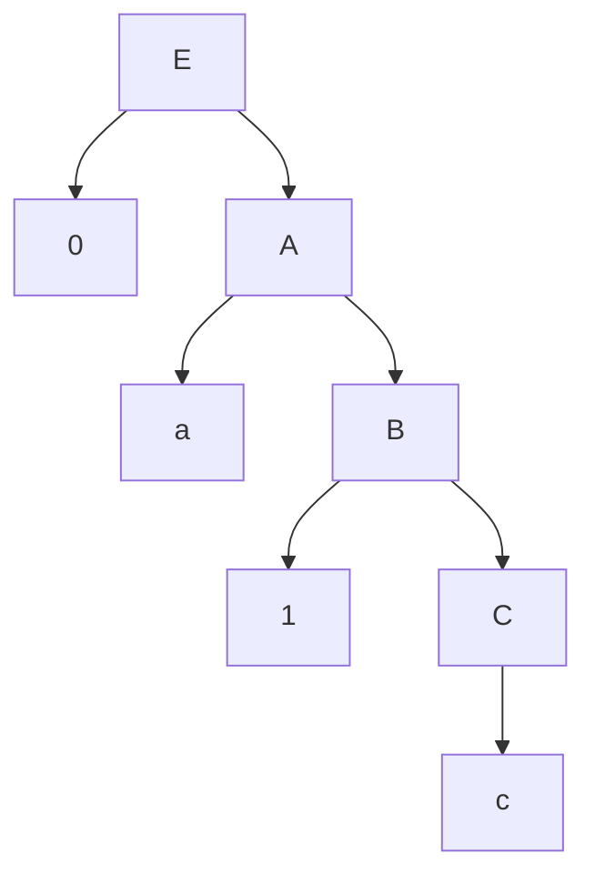
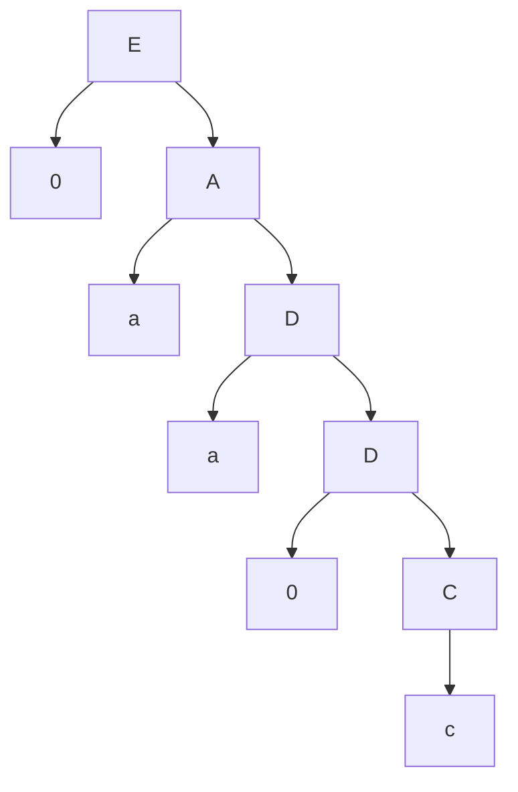
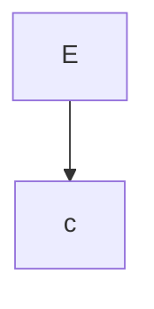
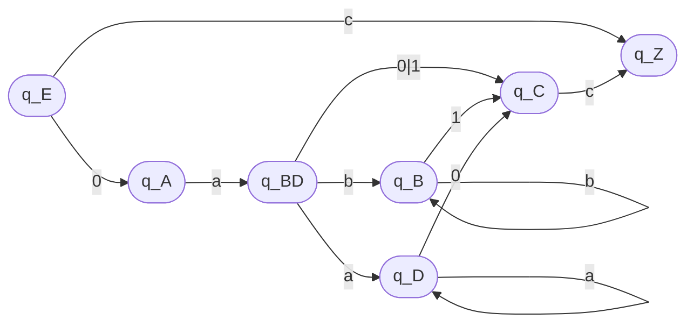

# Laborator 2 la Limbaje formale și automate

A elaborat: **Curmanschii Anton, IA1901.**

Tema: **Echivalența Gramaticilor Regulate și a Automatelor Finite.**

**Varianta 6.**

## Sarcinile

1. Să se genereze trei forme propoziționale (cuvinte).

2. Să se construiască arborele de derivare pentru fiecare din cuvintele generate.

3. Să se construiască automatul finit echivalent.

4. Printr-un calcul de configurații să se demonstreze că formele propoziționale generate de gramatică sunt acceptate și de automatul finit construit.

5. Să se scrie expresia regulată a cuvintelor generate de gramatica dată.

## Rezolvările

$ G = (V_T, V_N, P, S) $

$ V_T = \\{ 0, 1, c, a \\} $

$ V_N = \\{ E, A, B, C, D \\} $

$ S = E $

$ P =
\begin{cases}
E \rightarrow 0A | c \\\\
A \rightarrow aB | aD \\\\
B \rightarrow bB | 1C | c \\\\
C \rightarrow c \\\\
D \rightarrow aD | 0C | c \\\\
\end{cases}
$

> 1\. Să se genereze trei forme propoziționale (cuvinte).
> 
> 2\. Să se construiască arborele de derivare pentru fiecare din cuvintele generate.

$
E \xrightarrow{ E \rightarrow 0A } 0A 
\xrightarrow{ A \rightarrow aB } 0aB 
\xrightarrow{ B \rightarrow 1C } 0a1C
\xrightarrow{ C \rightarrow c } 0a1c
$

$
E \xrightarrow{ E \rightarrow 0A } 0A
\xrightarrow{ A \rightarrow aD } 0aD 
\xrightarrow{ D \rightarrow aD } 0aaD 
\xrightarrow{ D \rightarrow 0C } 0aa0C 
\xrightarrow{ C \rightarrow c } 0aa0c
$ 

$
E \xrightarrow{ E \rightarrow c } c
$

> 3\. Să se construiască automatul finit echivalent.

Automatul finit: $ 
AF = (Q, \Sigma, \delta, q_E, F), \\\\
Q = \\{ q_E, q_A, q_{BD}, q_B, q_D, q_C, q_Z \\},   \\\\
\Sigma = \\{ a, b, 0, 1 \\},         \\\\
F = \\{ q_Z \\},                  \\\\
\delta(q_E, c) =\\{ q_Z \\}, \delta(q_E, 0) = \\{ q_A \\}, \\\\ 
\delta(q_A, a) = \\{ q_{BD} \\}, \\\\
\delta(q_{BD}, b) = \\{ q_B \\}, \delta(q_{BD}, a) = \\{ q_D \\}, \\\\
\delta(q_{BD}, 0) = \\{ q_C \\}, \delta(q_{BD}, 1) = \\{ q_C \\}, \\\\
\delta(q_{B}, b) = \\{ q_B \\}, \delta(q_{B}, 1) = \\{ q_C \\}, \\\\
\delta(q_{D}, a) = \\{ q_D \\}, \delta(q_{D}, 0) = \\{ q_C \\}, \\\\
\delta(q_{C}, c) = \\{ q_Z \\}.
$

> 4\. Printr-un calcul de configurații să se demonstreze că formele propoziționale generate de gramatică sunt acceptate și de automatul finit construit.

1. **0a1c**

$ (q_E, 0a1c) \vdash (q_A, a1c) \vdash (q_{BD}, 1c) \vdash (q_{C}, c) \vdash (q_{Z}, \varepsilon) $

2. **0aa0c**

$ (q_E, 0aa0c) \vdash (q_A, aa0c) \vdash (q_{BD}, a0c) \vdash (q_{D}, 0c) \vdash (q_{C}, c) \vdash (q_{Z}, \varepsilon) $

3. **c**

$ (q_E, c) \vdash (q_Z, \varepsilon) $

> 5\. Să se scrie expresia regulată a cuvintelor generate de gramatica dată.

Un *c* sau (*ab* urmat de ((*0* sau *1*) sau (*b*, orice număr de *b*, *1*) sau (*a*, orice număr de *a*, *0*)) urmat de *c*).

$ c + ab ((0 + 1) + (b b^{\star} 1) + (a a^{\star} 0)) c $

Parantezele pot fi omise.

$ c + ab (0 + 1 + b b^{\star} 1 + a a^{\star} 0) c $

Pentru claritate poate fi folosit și simbolul operatorul de concatenare, ".".

$ c + a.b.(0 + 1 + b.b^{\star}.1 + a.a^{\star}.0).c $
