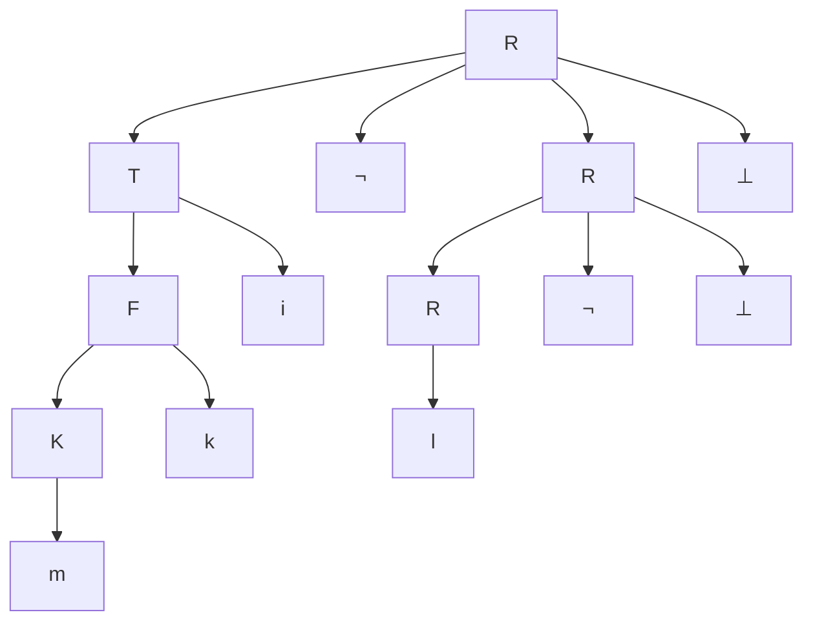
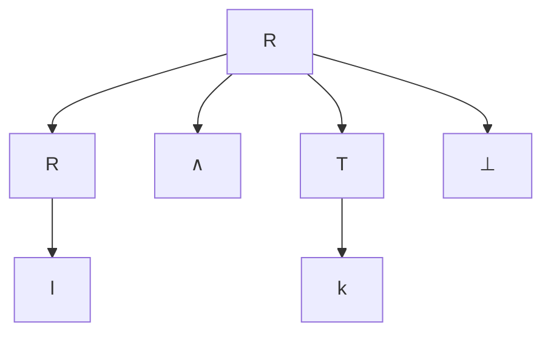

# Laborator 3 la Limbaje formale și automate

A elaborat: **Curmanschii Anton, IA1901.**

Tema: **$\varepsilon$-Producții**

**Varianta 6.**

## Sarcinile

1. Să se elimine $\varepsilon$-producțiile;

2. Să se elimine regulile singulare;

3. Să se elimine simbolurile inutile;

4. Să se genereze două cuvinte și să se construiască arborele de derivare;

## Rezolvările

$ G = (V_T, V_N, P, S) $

$ V_T = \\{ \lnot, \land, \bot, i, j, k, m, \varepsilon \\} $

$ V_N = \\{ R, T, I, F, K \\} $

$ S = R $

$ P =
\begin{cases}
R \rightarrow R \lnot T \bot | R \land T \bot | l \\\\
T \rightarrow F | Fi | Fj | Tk | \varepsilon \\\\
F \rightarrow Kk \\\\
K \rightarrow Ki | Km | m \\\\
\end{cases}
$

> 1\. Să se elimine $\varepsilon$-producțiile.

Avem doar o singură $\varepsilon$-producție, anume $ T \rightarrow \varepsilon $.

Peste tot unde avem T în partea dreaptă a altor reguli, anume regulile $ R \rightarrow R \lnot T \bot $,
$ R \rightarrow R \land T \bot $ și $ T \rightarrow Tk $, substituim $ T = \varepsilon $ pentru a produce câte o regulă nouă pentru fiecare caz.

$ (R \rightarrow R \lnot T \bot) \xrightarrow{T \rightarrow \varepsilon} (R \rightarrow R \lnot \bot); $

$ (R \rightarrow R \land T \bot) \xrightarrow{T \rightarrow \varepsilon} (R \rightarrow R \land \bot); $

$ (T \rightarrow Tk) \xrightarrow{T \rightarrow \varepsilon} (T \rightarrow k). $

Primim mulțimea de reguli $ P $ nouă care generează același limbaj, $ P^{\prime} $:

$ P^{\prime} =
\begin{cases}
R \rightarrow R \lnot T \bot | R \lnot \bot | R \land T \bot | R \land \bot | l \\\\
T \rightarrow F | Fi | Fj | Tk | k \\\\
F \rightarrow Kk \\\\
K \rightarrow Ki | Km | m \\\\
\end{cases}
$

> 2\. Să se elimine regulile singulare.

Regulile singulare sunt regulile de tipul $ A \rightarrow B $. Avem doar $ T \rightarrow F $.
$F$-ul din $ T \rightarrow F $ va fi substituit la definiția lui completă: $ F \rightarrow Kk $.

$ P^{\prime \prime} =
\begin{cases}
R \rightarrow R \lnot T \bot | R \lnot \bot | R \land T \bot | R \land \bot | l \\\\
T \rightarrow Kk | Fi | Fj | Tk | k \\\\
F \rightarrow Kk \\\\
K \rightarrow Ki | Km | m \\\\
\end{cases}
$

> 3\. Să se elimine simbolurile inutile.

$
P = \\{ K, F, T, R \\}, \overline{P} = V_N \setminus P = \emptyset.
$

Astfel, nu avem nici o regulă neproductivă (inutilă). 

> Intuitiv, o regulă inutilă este de fapt acea regulă care mereu aduce la recursie infinită.

Acum eliminăm toate regulile neaccesibile.
$ R $ este axioma și este mereu accesibilă, $ T $ poate fi accesată din $ R $, $ K $ și $ F $ pot fi accesate din $ T $, deci toate regulile sunt accesibile.

> 4\. Să se genereze două cuvinte și să se construiască arborele de derivare.

<!-- Limbajul gramaticii noi $ G^{\prime \prime \prime \prime} = (V_T, V_N, P^{\prime \prime \prime \prime}, S), F(G^{\prime \prime \prime \prime}), $ este vid, deoarece gramatica $ G^{\prime \prime \prime \prime} $ nu conține nici o regulă.
Nu putem construi nici o regulă. -->

$ 
R \xrightarrow{ R \rightarrow R \lnot T \bot } R \lnot T \bot 
\xrightarrow{ T \rightarrow Fi } R \lnot Fi \bot 
\xrightarrow{ F \rightarrow Kk } R \lnot Kki \bot \rightarrow \\\\
\xrightarrow{ K \rightarrow Ki } R \lnot Kiki \bot
\xrightarrow{ K \rightarrow m } R \lnot miki \bot \rightarrow \\\\
\xrightarrow{ R \rightarrow R \lnot \bot } R \lnot \bot \lnot miki \bot
\xrightarrow{ R \rightarrow l } l \lnot \bot \lnot miki \bot.
$

$ 
R \xrightarrow{ R \rightarrow R \land T \bot } R \land T \bot 
\xrightarrow{ T \rightarrow k } R \land k \bot 
\xrightarrow{ R \rightarrow l } l \land k \bot
$

