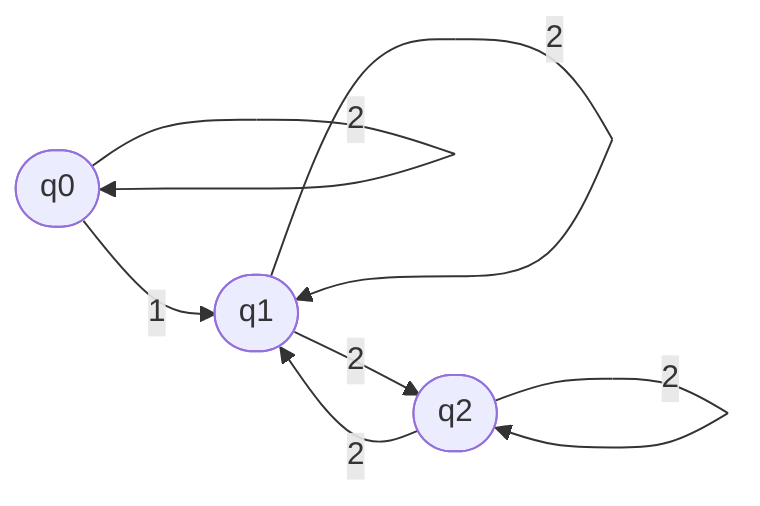
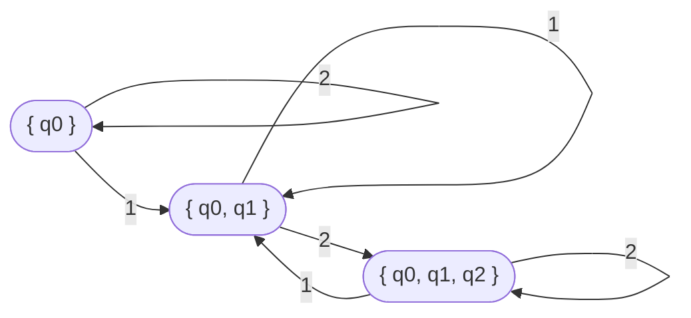
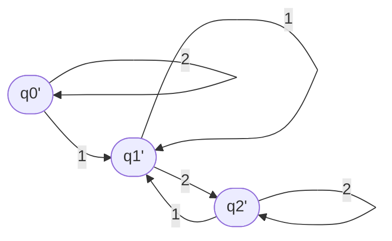

Student: **Curmanschii Anton, IA1901.**

Fie automatul finit:

$ 
AF = (Q, \Sigma, \delta, q _ 0, F) \\\\
Q = \\{ q _ 0, q _ 1, q _ 2 \\} \\\\
\Sigma = \\{ 1, 2 \\} \\\\
F = \\{ q _ 2 \\} \\\\
\delta(q _ 0, 1) = \\{ q _ 0, q _ 1 \\}, \delta(q _ 0, 2) = \\{ q _ 0 \\} \\\\
\delta(q _ 1, 2) = \\{ q _ 1, q _ 2 \\}, \delta(q _ 2, 2) = \\{ q _ 1, q _ 2 \\}
$

> Reprezentați automatul finit în formă tabelară și grafică.

|         | **1**            | **2**          |
|---------|------------------|----------------|
| $q _ 0$ | $q _ 0$, $q _ 1$ | $q _ 0$        |
| $q _ 1$ | error            | $q _ 1, q _ 2$ |
| $q _ 2$ | error            | $q _ 1, q _ 2$ |

Starea $ q _ 2 $ este terminală și trebuie să fie într-un cerc dublu .
Eu nu arăt aceasta, deoarece programul nu permite.

> Construiţi automatul finit determinist echivalent.

Starea inițială $ q _ 0 ^ \prime = \\{ q _ 0 \\} $.

Rezolvăm trecerea $ \delta(q _ 0, 1) = \\{ q _ 0, q _ 1 \\} $. 
Se adaugă starea $ q _ {01} ^ \prime = \\{ q _ 0, q _ 1 \\} $, și trecerea $ \delta(q _ 0 ^ \prime, q _ {01} ^ \prime) $.
(Am notat și starea $ q _ {01} ^ \prime $ cu un $ \prime $ ca notația să fie similară).

$ 
\delta(q _ 0, 2) = \\{ q _ 0 \\}  \rightarrow   \delta(q _ 0 ^ \prime, 2) = \\{ q _ 0 ^ \prime \\}
$

Acum facem aceleași pași pentru starea nouă $ q _ {01} ^ \prime $

$
\delta(q _ 0, 1) = \\{ q _ 0, q _ 1 \\}, \delta(q _ 1, 1) = \\{ \\} \rightarrow 
\delta(q _ {01} ^ \prime, 1) = \\{ q _ {01} ^ \prime \\}
$

$
\delta(q _ 0, 2) = \\{ q _ 0 \\}, \delta(q _ 1, 2) = \\{ q _ 1, q _ 2 \\} \rightarrow 
\delta(q _ {01} ^ \prime, 2) = \\{ q _ {012} ^ \prime \\} \\\\
q _ {012} ^ \prime = \\{ q _ 0, q _ 1, q _ 2 \\}
$

Pentru $ q _ {012} $:

$
\delta(q _ 0, 1) = \\{ q _ 0, q _ 1 \\}, \delta(q _ 1, 1) = \\{ \\}, \delta(q _ 2, 1) = \\{ \\} \rightarrow \\\\
\rightarrow \delta(q _ {012} ^ \prime, 1) = \\{ q _ {01} ^ \prime \\}
$

$
\delta(q _ 0, 2) = \\{ q _ 0 \\}, \delta(q _ 1, 2) = \\{ q _ 1, q _ 2 \\}, \delta(q _ 2, 2) = \\{ q _ 1, q _ 2 \\} \rightarrow \\\\
\rightarrow \delta(q _ {012} ^ \prime, 1) = \\{ q _ {012} ^ \prime \\}
$

$ 
{AF}^\prime = (Q ^ { \prime }, \Sigma ^ { \prime }, \delta ^ { \prime }, q ^ { \prime } _ { 0 }, F ^ { \prime }),     \\\\
Q ^ { \prime } = \\{ q ^ { \prime } _ { 0 }, q ^ { \prime } _ { 1 }, q ^ { \prime } _ { 2 }, q ^ { \prime } _ { 3 }, q ^ { \prime } _ { 4 } \\}, \\\\
q ^ { \prime } _ { 0 } = \\{ q _ 0 \\} \\\\
q ^ { \prime } _ { 1 } := q ^ { \prime } _ { 01 } = \\{ q _ 0, q _ 1 \\} \\\\
q ^ { \prime } _ { 2 } := \\{ q _ 0, q _ 1, q _ 2 \\} \\\\
\Sigma ^ { \prime } = \\{ 1, 2 \\},         \\\\
F ^ { \prime } = \\{ q ^ { \prime } _ { 2 } \\},  \\\\
\delta(q _ 0 ^ \prime, 1) = \\{ q ^ { \prime } _ { 1 } \\}, \delta(q _ 0 ^ \prime, 2) = \\{ q _ 0 ^ \prime \\} \\\\
\delta(q _ 1 ^ \prime, 1) =  \\{ q _ 1 ^ \prime \\}, \delta(q _ 1 ^ \prime, 2) = \\{ q _ 2 ^ \prime \\} \\\\
\delta(q _ 2 ^ \prime, 1) =  \\{ q _ 1 ^ \prime \\}, \delta(q _ 2 ^ \prime, 2) = \\{ q _ 2 ^ \prime \\} \\\\
$

> Reprezentați automatul finit determinist în formă grafică.

