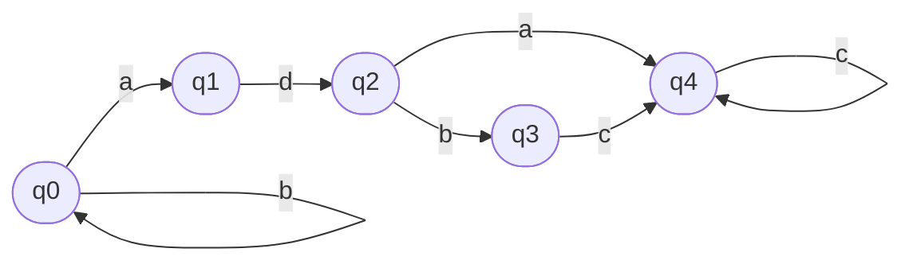

Student: **Curmanschii Anton, IA1901.**

Construiți automatul finit pentru expresia regulată $ e= (a+b) * ad (a+bc) c * $

$ 
AF = (Q, \Sigma, \delta, q _ 0, F) \\\\
Q = \\{ q _ 0, q _ 1, q _ 2, q _ 3, q _ 4 \\} \\\\
\Sigma = \\{ a, b, c, d \\} \\\\
F = \\{ q _ 4 \\} \\\\
\delta(q _ 0, a) = \\{ q _ 0, q _ 1 \\}, \delta(q _ 0, b) = \\{ q _ 0 \\} \\\\
\delta(q _ 1, d) = \\{ q _ 2 \\}, \\\\
\delta(q _ 2, a) = \\{ q _ 4 \\}, \delta(q _ 2, b) = \\{ q _ 3 \\} \\\\
\delta(q _ 3, c) = \\{ q _ 4 \\} \\\\
\delta(q _ 4, c) = \\{ q _ 4 \\}
$

