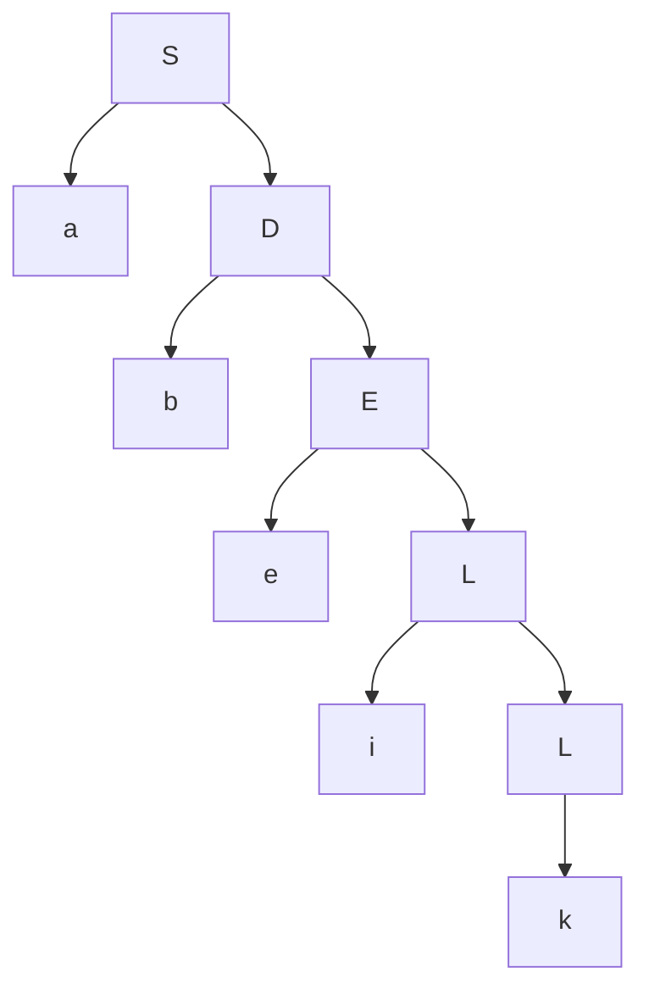

Student: **Curmanschii Anton, IA1901.**

Fie $ G=( V_N, V_T, P, S) $ gramatică regulată.  $ V_N={S, D, E, F, L}, V_T={a, b, c, d, e, i, k} $, 

$ P = \\{
    1.S \rightarrow aD \\\\ 
    2.D \rightarrow bE  \\\\ 
    3.E \rightarrow cF \\\\ 
    4.E \rightarrow eL \\\\ 
    5.F \rightarrow dL \\\\ 
    6.L \rightarrow iL \\\\ 
    7.L \rightarrow k \\\\
    8.F \rightarrow a \\\\ \\} 

Generați un cuvânt din gramatica dată și construiți arborele de derivare.

**abeik**

$
S \xrightarrow{S \rightarrow aD} aD \\\\
aD \xrightarrow{D \rightarrow bE} abE \\\\
abE \xrightarrow{E \rightarrow eL} abeL \\\\
abeL \xrightarrow{L \rightarrow iL} abeiL \\\\
abeiL \xrightarrow{L \rightarrow k} abeik
$

