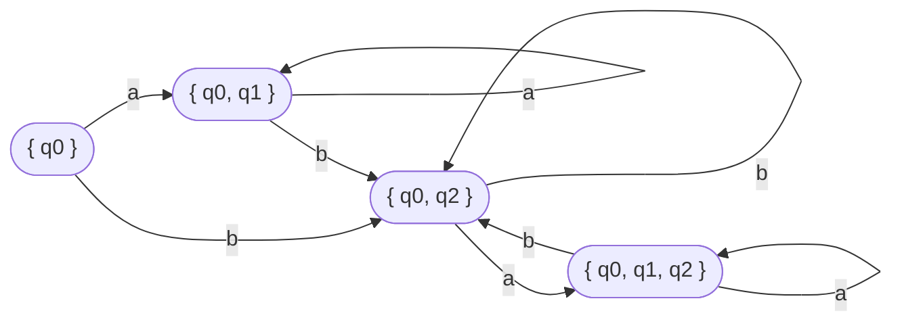

Student: **Curmanschii Anton, IA1901.**

Fie  AF=(Q,Σ,δ,q0,F) automat finit. Q={q0,q1,q2 },  Σ={a,b}, F={q2}, 

δ(q0,a)={q0,q1},  δ(q0,b)={q0, q2},   δ(q1,b)={q2}, δ(q2,a)={ q1,q2} 

Construiți automatul finit echivalent determinist.

Stările inițiale:
$ q _ 0 ^ { \prime } = \\{ q_0 \\} $

$
\delta(q _ 0, a) = \\{ q _ 0, q _ 1 \\} \rightarrow 
\delta(q _ {0} ^ \prime, a) = \\{ q _ {01} ^ \prime \\}, q _ {01} ^ \prime = \\{ q_0, q_1 \\}
$

$
\delta(q _ 0, b) = \\{ q _ 0, q _ 2 \\} \rightarrow 
\delta(q _ {0} ^ \prime, b) = \\{ q _ {02} ^ \prime \\}, q _ {02} ^ \prime = \\{ q_0, q_2 \\}
$

$
\delta(q _ 0, a) = \\{ q _ 0, q _ 1 \\} \rightarrow 
\delta(q _ {01} ^ \prime, a) = \\{ q _ {01} ^ \prime \\}
$

$
\delta(q _ 0, b) = \\{ q _ 0, q _ 2 \\}, \delta(q _ 1, b) = \\{ q _ 2 \\} \rightarrow 
\delta(q _ {01} ^ \prime, b) = \\{ q _ {02} ^ \prime \\}, q _ {02} ^ \prime = \\{ q_0, q_2 \\} \cup \\{ q_2 \\} = \\{ q_0, q_2 \\}
$

$
\delta(q _ 0, a) = \\{ q _ 0, q _ 1 \\}, \delta(q _ 2, a) = \\{ q _ 1, q _ 2 \\} \rightarrow 
\delta(q _ {02} ^ \prime, a) = \\{ q _ {012} ^ \prime \\}, q _ {012} ^ \prime = \\{ q_0, q_1 \\} \cup \\{ q_1, q_2 \\} = \\{ q_0, q_1, q_2 \\}
$

$
\delta(q _ 0, b) = \\{ q _ 0, q _ 2 \\} \rightarrow 
\delta(q _ {02} ^ \prime, b) = \\{ q _ {02} ^ \prime \\}
$

$
\delta(q _ 0, a) = \\{ q _ 0, q _ 1 \\}, \delta(q _ 2, a) = \\{ q _ 1, q _ 2 \\} \rightarrow 
\delta(q _ {012} ^ \prime, a) = \\{ q _ {012} ^ \prime \\}
$

$
\delta(q _ 0, b) = \\{ q _ 0, q _ 2 \\}, \delta(q _ 1, b) = \\{ q _ 2 \\} \rightarrow 
\delta(q _ {012} ^ \prime, b) = \\{ q _ {02} ^ \prime \\}
$

$ 
{AF}^\prime = (Q ^ { \prime }, \Sigma ^ { \prime }, \delta ^ { \prime }, q ^ { \prime } _ { 0 }, F ^ { \prime }),     \\\\
Q ^ { \prime } = \\{ q ^ { \prime } _ { 0 }, q ^ { \prime } _ { 01 }, q ^ { \prime } _ { 02 }, q ^ { \prime } _ { 012 }, \\\\
\Sigma ^ { \prime } = \\{ a, b \\},         \\\\
F ^ { \prime } = \\{ q ^ { \prime } _ { 012 }, q ^ { \prime } _ { 02 } \\},  \\\\
\delta(q _ {0} ^ \prime, a) = \\{ q ^ { \prime } _ { 01 } \\}, \delta(q _ 0 ^ \prime, b) = \\{ q _ {02} ^ \prime \\} \\\\
\delta(q _ {01} ^ \prime, a) =  \\{ q _ {01} ^ \prime \\}, \delta(q _ {01} ^ \prime, b) = \\{ q _ {02} ^ \prime \\} \\\\
\delta(q _ {02} ^ \prime, a) =  \\{ q _ {012} ^ \prime \\}, \delta(q _ {02} ^ \prime, b) = \\{ q _ {02} ^ \prime \\} \\\\
\delta(q _ {012} ^ \prime, a) =  \\{ q _ {012} ^ \prime \\}, \delta(q _ {012} ^ \prime, b) = \\{ q _ {02} ^ \prime \\} \\\\
$

