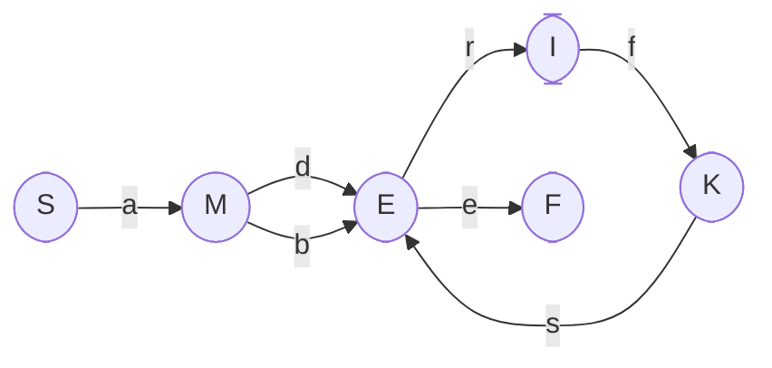

Student: **Curmanschii Anton, IA1901.**

Fie $ G=( V_N, V_T, P, S) $ gramatică regulată.  

$ V_N=\\{S, M, E, I, K\\}, V_T=\\{a, b, d, e, f, s, r\\}, $

$ P=\\{\\\\
    1. S \rightarrow aM  \\\\
    2. M \rightarrow dE \\\\
    3. M \rightarrow bE  \\\\
    4. E \rightarrow e  \\\\ 
    5. E \rightarrow rI \\\\
    6. I \rightarrow fK \\\\  
    7. K \rightarrow sE \\\\ 
\\} $

Construiti automatul finit echivalent gramaticii date.

$ F = $ starea finală.

Automatul finit: $ 
AF = (Q, \Sigma, \delta, q_0, \\{ F \\}), \\\\
Q = \\{ S, M, E, I, F \\},   \\\\
\Sigma = \\{ a, b, d, e, f, s, r \\},         \\\\
\delta(S, a) =\\{ M \\},  \\\\
\delta(M, d) = \\{ E \\}, \delta(M, b) = \\{ E \\}, \\\\ 
\delta(E, e) = \\{ F \\}, \delta(E, r) = \\{ I \\}, \\\\ 
\delta(I, f) =\\{ K \\}, \\\\
\delta(K, s) =\\{ E \\} \\\\
$
