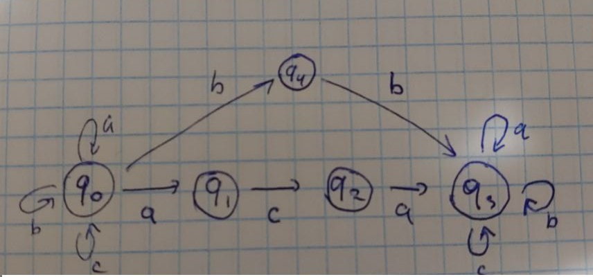

Student: **Curmanschii Anton, IA1901.**

Construiți automatul finit (forma grafică) corespunzător limbajului de mai jos:

$ L = \\{ x | x \in \\{a,b,c\\} $ și $x$ posedă aca sau bb în calitate de subcuvinte $ \\} $

Deoarece $ x $ poate fi unul din $a, b$ sau $c, L = \emptyset $.
Dar probabil ați avut în vedere că $ x \in {\\{a,b,c\\}} ^ {\star} $.

