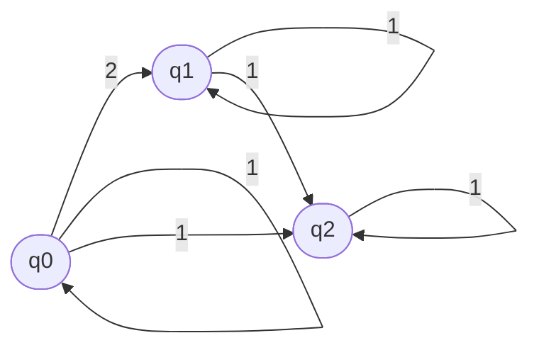

Student: **Curmanschii Anton, IA1901.**

Fie  $AF=(Q,Σ, δ,q_0,F)$ automat finit. $Q=\\{ q_0,q_1,q_2\\}, Σ=\\{1,2\\}, F=\\{q_2\\},$

 $δ(q_0,2)=\\{q_1\\},  δ(q_0,1)=\\{ q_0 ,q_2\\}, δ(q_1,1)=\\{ q_1,q_2\\}, δ(q_2,1)=\\{q_2\\}  $

Construiți forma grafică  a AF.

Starea finală: $q_2$

