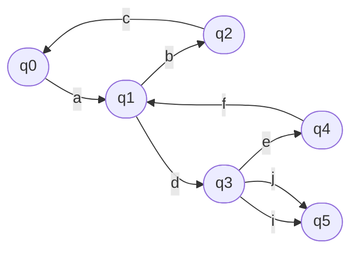

Student: **Curmanschii Anton, IA1901.**

Construiți gramatica regulată echivalentă automatului finit  dat.

$
AF=(Q, Σ,δ,q_0 ,F), \\\\
Q = \\{ q_0 ,q_1 ,q_2 , q_3 ,q_4 ,q_5 \\}, \\\\
S=\\{a, b, c, d, e, f, i, j \\} \\\\
F=\\{q_5 \\}, \\\\
δ(q_0,a)=\\{q_1 \\},  \\\\
δ(q_1 ,b)=\\{q_2 \\}, 
δ(q_1 ,d)=\\{q_3 \\}, \\\\
δ(q_2 ,c)=\\{q_0 \\},  \\\\
δ(q_3 ,e)=\\{q_4 \\},
δ(q_3 ,i)=\\{q_5 \\},
δ(q_3 ,j)=\\{q_5 \\}, \\\\
δ(q_4 ,f)=\\{q_1 \\} \\\\
$

$ a (bca+def) ^ \star d (ef (bca + def) ^ \star d) ^ \star (i + j) $