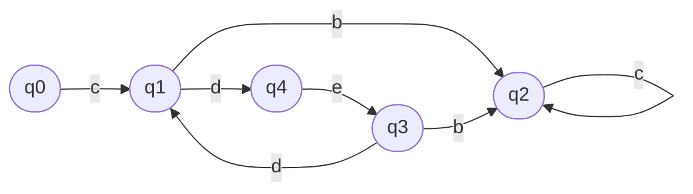

Student: **Curmanschii Anton, IA1901.**

Fie $ AF=(Q, Σ,δ, q_0,F), Q=\\{q_0,q_1,q_2, q_3, q_4\\},  Σ=\\{b,c,d,e\\}, F=\\{q_2\\} $

$ 
δ(q_0, c) = \\{q_1\\}, \\\\
δ(q_1, b) = \\{q_2\\}, δ(q_1,d)=\\{q_4\\}, \\\\
δ(q_2, c) = \\{q_2\\}, \\\\
δ(q_3, b) = \\{q_2\\}, δ(q_3, d)=\\{q_1\\} \\\\
δ(q_4, e) = \\{q_3\\}, \\\\
$

Aplicând lema de pompare pentru cuvântul $ z=cdeddebc $ construiți descompunerea z=uvw.

$ z=cdeddebc $

Avem mai multe variante:

$ u = cdeddeb, v = c, w = \epsilon $

$ cdeddeb (c)^i \in L, \forall i \geq 0 $

$ u = cde, v = dde, w = bc $

$ cde (dde)^i bc \in L, \forall i \geq 0 $
