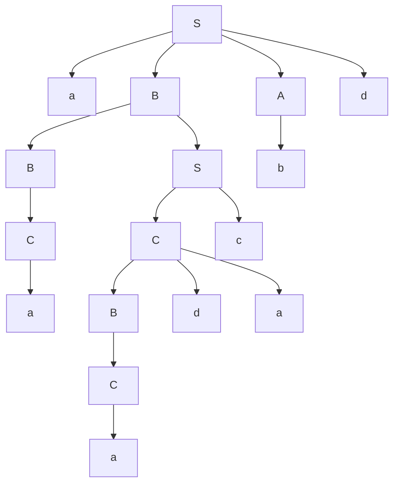

$G=(V_N, V_T, P, S), $

$V_n={S,A,B,C,}, $

$V_t={ a,b,c,d}, $

$P=
\begin{cases}
S \rightarrow aABd \\\\  
S \rightarrow aBa  \\\\   
S \rightarrow AC   \\\\
S \rightarrow Ba \\\\
S \rightarrow Cc  \\\\
A \rightarrow bA \\\\
A \rightarrow b  \\\\
A \rightarrow CdC  \\\\ 
A \rightarrow C    \\\\
B \rightarrow SB \\\\
B \rightarrow C   \\\\
C \rightarrow a    \\\\
C \rightarrow Bda
\end{cases}$.

Generați un cuvant utilizând derivarea de dreapta și construiți arborele de derivare.

$ S \xrightarrow{S \rightarrow aABd} aABd \rightarrow \\\\
\xrightarrow{B \rightarrow SB} aASBd \rightarrow \\\\
\xrightarrow{B \rightarrow C} aASCd \rightarrow \\\\
\xrightarrow{C \rightarrow a} aASad \rightarrow \\\\
\xrightarrow{S \rightarrow Cc} aACcad \rightarrow \\\\
\xrightarrow{C \rightarrow Bda} aABdacad \rightarrow \\\\
\xrightarrow{B \rightarrow C} aACdacad \rightarrow \\\\
\xrightarrow{C \rightarrow a} aAadacad \rightarrow \\\\
\xrightarrow{A \rightarrow b} abadacad $

(Ordinea vizualizării poate să nu corespundă ordinii literelor în cuvântul, deoarece se face automat). 

