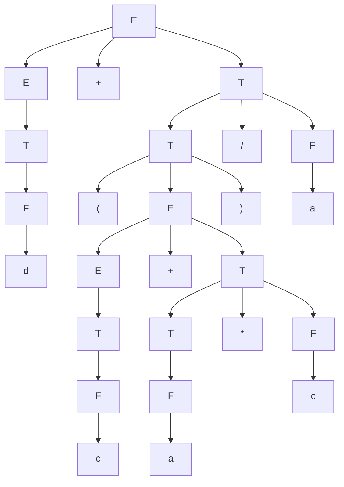

Fie gramatica independentă de context 

$ G=(V_N, V_T, P, E), \\\\
V_N=\\{E,T,F\\}, \\\\ 
V_T=\\{ a, b, c, d, +, -, * , /, (, )\\}, \\\\
P=
\begin{cases}
E \rightarrow T|E+T|E-T \\\\  
T \rightarrow F|T * F| T / F  \\\\   
F \rightarrow (E)|a|b|c|d  \\\\
\end{cases} $.

Determinați  derivarea de stânga a   cuvântului  `d+(c+a*c)/a`   și construiți arborele de derivare.

$ E \xrightarrow{E \rightarrow E+T} E \rightarrow E+T \\\\
\xrightarrow{E \rightarrow T} T+T \rightarrow \\\\
\xrightarrow{T \rightarrow F} F+T \rightarrow \\\\
\xrightarrow{F \rightarrow d} d+T \rightarrow \\\\
\xrightarrow{T \rightarrow T/F} d+T/F \rightarrow \\\\
\xrightarrow{T \rightarrow (E)} d+(E)/F \rightarrow \\\\
\xrightarrow{E \rightarrow E+T} d+(E+T)/F \rightarrow \\\\
\xrightarrow{E \rightarrow T} d+(T+T)/F \rightarrow \\\\
\xrightarrow{T \rightarrow F} d+(F+T)/F \rightarrow \\\\
\xrightarrow{F \rightarrow c} d+(c+T)/F \rightarrow \\\\
\xrightarrow{T \rightarrow T * F} d+(c+T * F)/F \rightarrow \\\\
\xrightarrow{T \rightarrow F} d+(c+F * F)/F \rightarrow \\\\
\xrightarrow{F \rightarrow a} d+(c+a * F)/F \rightarrow \\\\
\xrightarrow{F \rightarrow c} d+(c+a * c)/F \rightarrow \\\\
\xrightarrow{F \rightarrow a} d+(c+a * c)/a $

(Ordinea vizualizării poate să nu corespundă ordinii literelor în cuvântul, deoarece se face automat). 

