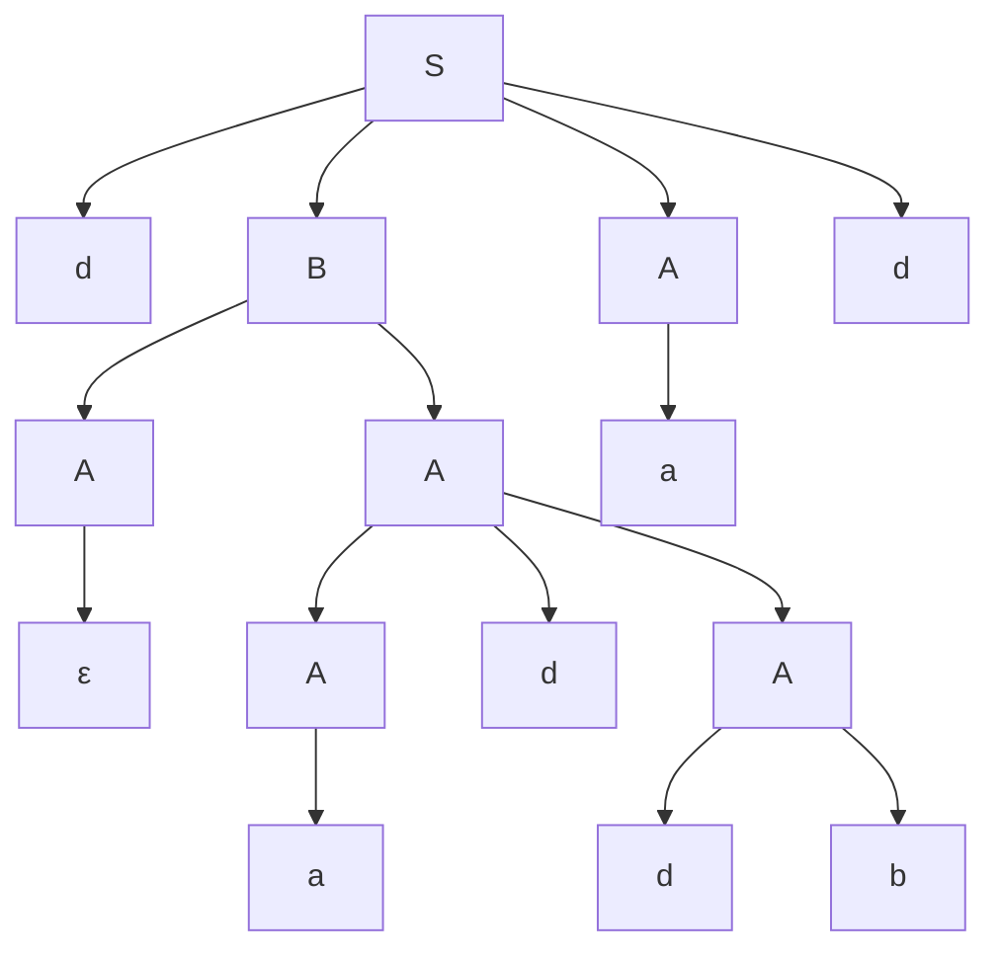

Examen la LFA, tema 1.

Student: **Curmanschii Anton, IA1901.**

Fie dată gramatica independentă de context:

$ G = (V_N, V_T, P, S). \\\\
V_N= \\{S, A, B, D\\}, \\\\
V_T = \\{a, b, d\\}, \\\\
P =
\begin{cases}
S \rightarrow dBAd \\\\
S \rightarrow Aa \\\\
A \rightarrow bdA \\\\
A \rightarrow AdB \\\\
A \rightarrow \varepsilon \\\\
A \rightarrow a \\\\
B \rightarrow db \\\\
B \rightarrow AA \\\\
B \rightarrow b \\\\
D \rightarrow DbD \\\\
D \rightarrow DdD \\\\
\end{cases} $

> 1\.(5p.) Reprezentați un cuvânt generat de gramatica dată sub formă de arbore.

$ S \xrightarrow{S \rightarrow dBAd} S \rightarrow dBAd \\\\
\xrightarrow{B \rightarrow AA} dAAAd \rightarrow \\\\
\xrightarrow{A \rightarrow \varepsilon} dAAd \rightarrow \\\\
\xrightarrow{A \rightarrow AdB} dAdBAd \rightarrow \\\\
\xrightarrow{A \rightarrow a} dadBAd \rightarrow \\\\
\xrightarrow{B \rightarrow db} daddbAd \rightarrow \\\\
\xrightarrow{A \rightarrow a} daddbad $

> 2\. (45p.)Efectuați transformările echivalente  asupra gramaticii independente de context date ( simboluri inutile, e-producții,  reguli singulare, recursia stângă).

*simboluri inutile* sunt acele simboluri care sunt neproductive (care nu aduc la simboluri terminale), și/sau neaccesibile (la care nu putem ajunge de la $S$).

De exemplu, regulile asociate neterminalului $D$ niciodată nu termină cu un simbol terminal, aducând la recursia infinită în $D$. $D$ este și neaccesibil, deoarece nici o altă regulă nu trece în $D$. Deci, $D$ și toate regulile asociate lui $D$ pot fi simplu eliminate.

Se poate ușor observa că celelalte regulile sunt utile (și accesibile, și productive).

$P ^ {\prime}=
\begin{cases}
S \rightarrow dBAd \\\\  
S \rightarrow Aa  \\\\   
A \rightarrow bdA   \\\\
A \rightarrow AdB \\\\
A \rightarrow \varepsilon  \\\\
A \rightarrow a  \\\\
B \rightarrow db \\\\
B \rightarrow AA  \\\\
B \rightarrow b  \\\\
\end{cases} $

*\varepsilon-producții* sunt regulile de forma $ R \rightarrow \varepsilon $.

Avem așa regulă $ A \rightarrow \varepsilon $. Peste tot unde apare $A$, duplicăm acea regulă, substituind $\varepsilon$ în loc de $A$:

$ S \rightarrow dBAd \xrightarrow{A \rightarrow \varepsilon} S \rightarrow dBd $

$ S \rightarrow Aa \xrightarrow{A \rightarrow \varepsilon} S \rightarrow a $

$ A \rightarrow bdA \xrightarrow{A \rightarrow \varepsilon} A \rightarrow bd $

$ A \rightarrow AdB \xrightarrow{A \rightarrow \varepsilon} A \rightarrow dB $

$ B \rightarrow AA \xrightarrow{A \rightarrow \varepsilon} B \rightarrow A | \varepsilon $

$P ^ {\prime \prime}=
\begin{cases}
S \rightarrow dBAd \\\\
S \rightarrow dBd \\\\
S \rightarrow Aa  \\\\ 
S \rightarrow a \\\\  
A \rightarrow bdA   \\\\
A \rightarrow bd \\\\
A \rightarrow AdB \\\\
A \rightarrow dB \\\\
A \rightarrow a  \\\\
B \rightarrow db \\\\
B \rightarrow AA  \\\\
B \rightarrow A \\\\
B \rightarrow \varepsilon \\\\
B \rightarrow b  \\\\
\end{cases} $

Observăm că s-a obținut încă o $\varepsilon$-producție, anume $B \rightarrow \varepsilon$.
Facem același lucru și cu această regulă.

$ S \rightarrow dBAd \xrightarrow{B \rightarrow \varepsilon} S \rightarrow dAd $

$ S \rightarrow dBd \xrightarrow{B \rightarrow \varepsilon} S \rightarrow dd $

$ A \rightarrow AdB \xrightarrow{B \rightarrow \varepsilon} A \rightarrow Ad $

$ A \rightarrow dB \xrightarrow{B \rightarrow \varepsilon} A \rightarrow d $

$P ^ {\prime \prime \prime}=
\begin{cases}
S \rightarrow dBAd \\\\
S \rightarrow dAd \\\\
S \rightarrow dBd \\\\
S \rightarrow dd \\\\
S \rightarrow Aa  \\\\ 
S \rightarrow a \\\\  
A \rightarrow bdA   \\\\
A \rightarrow bd \\\\
A \rightarrow AdB \\\\
A \rightarrow Ad \\\\
A \rightarrow dB \\\\
A \rightarrow d \\\\
A \rightarrow a  \\\\
B \rightarrow db \\\\
B \rightarrow AA  \\\\
B \rightarrow A \\\\
B \rightarrow b  \\\\
\end{cases} $

*reguli singulare* sunt reguli de formă $ A \rightarrow B $, unde $ A, B \in V_T $.
Avem o singură așa regulă, anume $B \rightarrow A$.
O putem elimina, duplicând toate regulile unde apare $B$, substituind $A$, și ștergând regula $B \rightarrow A$.

$ S \rightarrow dBAd \xrightarrow{B \rightarrow A} S \rightarrow dAAd $

$ S \rightarrow dBd \xrightarrow{B \rightarrow A} S \rightarrow dAd $

$ A \rightarrow AdB \xrightarrow{B \rightarrow A} S \rightarrow AdA $

$ A \rightarrow dB \xrightarrow{B \rightarrow A} A \rightarrow dA $

$P ^ {\prime \prime \prime \prime}=
\begin{cases}
S \rightarrow dBAd \\\\
S \rightarrow dAAd \\\\
S \rightarrow dAd \\\\
S \rightarrow dBd \\\\
S \rightarrow dd \\\\
S \rightarrow Aa  \\\\ 
S \rightarrow a \\\\  
A \rightarrow bdA   \\\\
A \rightarrow bd \\\\
A \rightarrow AdB \\\\
A \rightarrow AdA \\\\
A \rightarrow Ad \\\\
A \rightarrow dB \\\\
A \rightarrow dA \\\\
A \rightarrow d \\\\
A \rightarrow a  \\\\
B \rightarrow db \\\\
B \rightarrow AA  \\\\
B \rightarrow b  \\\\
\end{cases} $

*recursia stângă* se manifestă în reguli de formă $ A \rightarrow Ax $, unde $ x \in V_T^{\star} $.
Avem trei astfel de reguli:

$ A \rightarrow AdB \\\\
A \rightarrow AdA \\\\
A \rightarrow Ad \\\\
$

Adaugăm câte o regulă nouă, $X$, care să reprezinte sfârșitul acestor regule.

$ X \rightarrow dB \\\\
X \rightarrow dBX \\\\
X \rightarrow dA \\\\
X \rightarrow dAX \\\\
X \rightarrow d \\\\
X \rightarrow dX \\\\
$

Iar $A$ deja îl transformăm:

$ A \rightarrow bdA \xrightarrow{A \rightarrow AX} A \rightarrow bdX $

$ A \rightarrow bd \xrightarrow{A \rightarrow AX} A \rightarrow bdX $

$ A \rightarrow dB \xrightarrow{A \rightarrow AX} A \rightarrow dBX $

$ A \rightarrow dA \xrightarrow{A \rightarrow AX} A \rightarrow dX $

$ A \rightarrow d \xrightarrow{A \rightarrow AX} A \rightarrow dX $

$ A \rightarrow a \xrightarrow{A \rightarrow AX} A \rightarrow aX $

$P ^ {\prime \prime \prime \prime \prime}=
\begin{cases}
S \rightarrow dBAd \\\\
S \rightarrow dAAd \\\\
S \rightarrow dAd \\\\
S \rightarrow dBd \\\\
S \rightarrow dd \\\\
S \rightarrow Aa  \\\\ 
S \rightarrow a \\\\  
A \rightarrow bdA \\\\
A \rightarrow bdX \\\\
A \rightarrow bd \\\\
A \rightarrow dBX \\\\
A \rightarrow dB \\\\
A \rightarrow dA \\\\
A \rightarrow dX \\\\
A \rightarrow d \\\\
A \rightarrow a  \\\\
A \rightarrow aX \\\\
X \rightarrow dB \\\\
X \rightarrow dBX \\\\
X \rightarrow dA \\\\
X \rightarrow dAX \\\\
X \rightarrow d \\\\
X \rightarrow dX \\\\
B \rightarrow db \\\\
B \rightarrow AA  \\\\
B \rightarrow b  \\\\
\end{cases} $

A doua formă implică simplificare regulilor prin admiterea $\varepsilon$-producțillor.
Deoarece o sarcină a fost de a le elimina, presupun că nu trebuie să realizez a doua metodă.