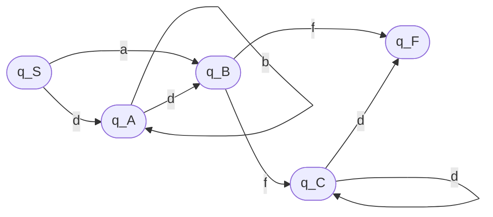
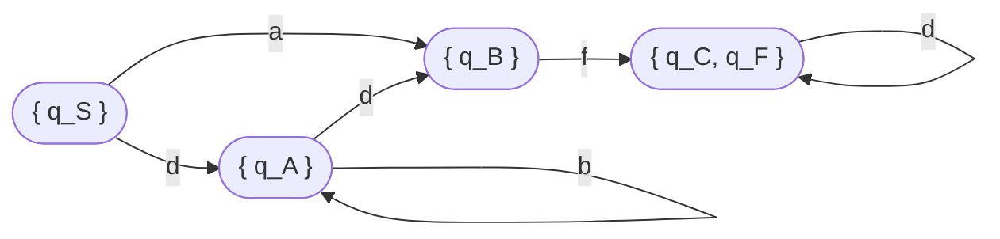

Examen la LFA, tema 2.

Student: **Curmanschii Anton, IA1901.**

Fie dată gramatica regulată:

$ G = (V_N, V_T, P, S). \\\\
V_N= \\{S, A, B, C\\}, \\\\
V_T = \\{a, b, d, f\\}, \\\\
P =
\begin{cases}
S \rightarrow dA \\\\
S \rightarrow aB \\\\
A \rightarrow dB \\\\
A \rightarrow bA \\\\
B \rightarrow fC  \\\\
B \rightarrow f \\\\
C \rightarrow dC \\\\
C \rightarrow d \\\\
\end{cases} $

> 1\. (10p.) Construiți automatul finit echivalent gramaticii $G$.

Automatul finit: 

$ AF = (Q, \Sigma, \delta, q_S, \\{ q_F \\}), \\\\
Q = \\{ q_S, q_A, q_B, q_C, q_F \\}, \\\\
\Sigma = \\{ a, b, d, f\\}, \\\\
F = \\{ q_Z \\}, \\\\
\delta(q_S, d) =\\{ q_A \\}, \delta(q_S, a) = \\{ q_B \\}, \\\\ 
\delta(q_A, d) = \\{ q_B \\}, \delta(q_A, b) = \\{ q_A \\}, \\\\
\delta(q_{B}, f) = \\{ q_C, q_F \\}, \\\\
\delta(q_{C}, d) = \\{ q_C, q_F \\}.
$

> 2\. (10p.) Scrieți expresia regulată a cuvintelor generate de gramatica G.

$ (a + d b^\star d)(f + f d^\star d) $

> 3\. (10p.) Găsiți reprezentarea x=uvw, ce verifică proprietățile lemei de pompare, pentru un șir acceptat de automatul finit.

Avem doar două cicluri în graf, anume ciclul $ C \rightarrow dC $ și $ A \rightarrow bA $.
Astfel, reprezentările uvw vor fi următoarele:

- $ d b^i df; u = d, v = b, w = df, i \geq 0 $
- $ d b^i df d^j d $, nu știu cum să reprezint aceasta prin simboluri, dar ideea este că $v$ poate fi oricare din $b$ sau $d$.
- $ a f d^i d; u = af, v = d, w = d, i \geq 0 $

Vom construi unele cuvinte conform primii și ultimii reprezentări.

Reprezentarea $ d b^i df $ admite cuvintele $ ddf $, $ dbdf $, $ dbbdf $, etc.

Reprezentarea $ a f d^i d $ admite cuvintele $ afd $, $ afdd $, $ afddd $, etc.

> 4\. (20p.) Construiți automatul finit determinist echivalent. (în caz că automatul finit dat este nedeterminist).

$ q_S ^ { \prime } = \\{ q_S \\} $

$
\delta(q _ S, a) = \\{ q _ B, \\} \rightarrow 
\delta(q _ {S} ^ \prime, a) = \\{ q _ {B} ^ \prime \\}, q _ {B} ^ \prime = \\{ q_B \\}
$

$
\delta(q _ S, d) = \\{ q _ A \\} \rightarrow 
\delta(q _ {S} ^ \prime, d) = \\{ q _ {A} ^ \prime \\}, q _ {A} ^ \prime = \\{ q_A \\}
$

$
\delta(q _ A, d) = \\{ q _ B \\} \rightarrow 
\delta(q _ {A} ^ \prime, d) = \\{ q _ {B} ^ \prime \\}
$

$
\delta(q _ A, b) = \\{ q _ A \\} \rightarrow 
\delta(q _ {A} ^ \prime, b) = \\{ q _ {A} ^ \prime \\}
$

$
\delta(q _ B, f) = \\{ q _ C, q _ F \\} \rightarrow 
\delta(q _ {B} ^ \prime, f) = \\{ q _ {CF} ^ \prime \\}, q_{CF} ^ \prime = \\{ q_C, q_F \\}
$

$
\delta(q _ C, d) = \\{ q _ C, q _ F \\} \rightarrow 
\delta(q _ {CF} ^ \prime, d) = \\{ q _ {CF} ^ \prime \\}
$

$ 
{AF}^\prime = (Q ^ { \prime }, \Sigma ^ { \prime }, \delta ^ { \prime }, q ^ { \prime } _ { S }, F ^ { \prime } ), \\\\
Q ^ { \prime } = \\{ q ^ { \prime } _ { S }, q ^ { \prime } _ { A }, q ^ { \prime } _ { B }, q ^ { \prime } _ { CF }, \\\\
\Sigma ^ { \prime } = \\{ a, b, d, f \\}, \\\\
F ^ { \prime } = \\{ q ^ { \prime } _ { CF } \\} \\\\
\delta(q _ {S} ^ \prime, a) = \\{ q ^ { \prime } _ { B } \\}, \delta(q _ S ^ \prime, d) = \\{ q _ {A} ^ \prime \\} \\\\
\delta(q _ {A} ^ \prime, d) =  \\{ q _ {B} ^ \prime \\}, \delta(q _ {A} ^ \prime, b) = \\{ q _ {A} ^ \prime \\} \\\\
\delta(q _ {B} ^ \prime, f) =  \\{ q _ {CF} ^ \prime \\}, \\\\
\delta(q _ {CF} ^ \prime, d) =  \\{ q _ {CF} ^ \prime \\}. \\\\
$

