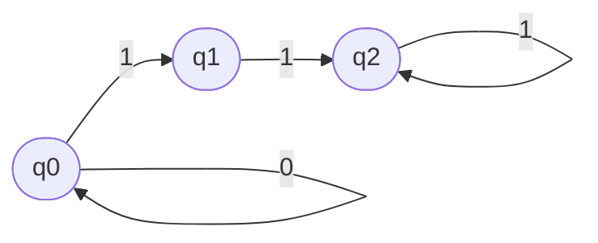
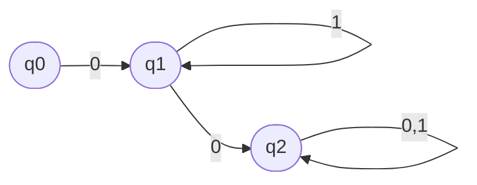
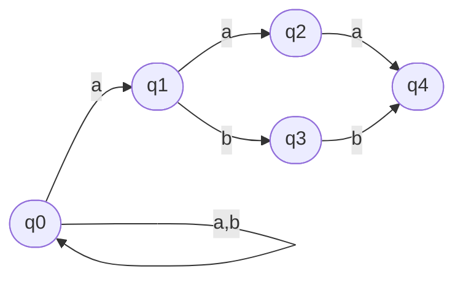
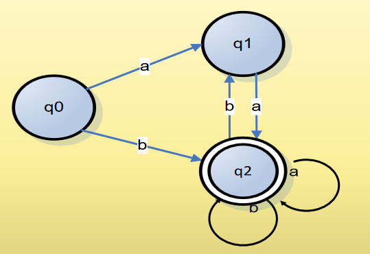

> $ 0^{\star} 1 1^{\star} $

$
AF = (Q, \Sigma, \delta, q_0, F), \\\\
Q = \\{ q_0, q_1, q_2 \\} \\\\
\Sigma = \\{ 0, 1 \\},    \\\\
F = \\{ q_2 \\},          \\\\
\delta(q_0, 0) = \\{ q_0 \\}, \delta(q_0, 1) = \\{ q_1 \\} \\\\
\delta(q_1, 1) = \\{ q_2 \\} \\\\
\delta(q_2, 1) = \\{ q_2 \\} \\\\
$

|       | $q_0$ | $q_1$ | $q_2$ |
|-------|-------|-------|-------|
| **0** | $q_0$ | error | error |
| **1** | $q_1$ | $q_2$ | $q_2$ |

> $ 0 1^{\star} 0 (0 + 1)^{\star} $

$
AF = (Q, \Sigma, \delta, q_0, F), \\\\
Q = \\{ q_0, q_1, q_2 \\} \\\\
\Sigma = \\{ 0, 1 \\},    \\\\
F = \\{ q_2 \\},          \\\\
\delta(q_0, 0) = \\{ q_1 \\} \\\\
\delta(q_1, 1) = \\{ q_1 \\}, \delta(q_1, 0) = \\{ q_2 \\} \\\\
\delta(q_2, 0) = \\{ q_2 \\}, \delta(q_2, 1) = \\{ q_2 \\} \\\\
$

|       | $q_0$ | $q_1$ | $q_2$ |
|-------|-------|-------|-------|
| **0** | $q_0$ | $q_2$ | $q_2$ |
| **1** | error | $q_1$ | $q_2$ |

> $ (a + b)^{\star} $ și cuvintele se termină cu aaa sau abb
>
> $ (a + b)^{\star} (aaa + abb) $  = $ ( a + b )^{\star} a (aa+bb) $

Nu poate fi un automat determinist.

$
AF = (Q, \Sigma, \delta, q_0, F), \\\\
Q = \\{ q_0, q_1, q_2, q_3, q_4 \\} \\\\
\Sigma = \\{ a, b \\},    \\\\
F = \\{ q_4 \\},          \\\\
\delta(q_0, a) = \\{ q_0, q_1 \\}, \delta(q_0, b) = \\{ q_0 \\} \\\\
\delta(q_1, a) = \\{ q_2 \\}, \delta(q_1, b) = \\{ q_3 \\} \\\\
\delta(q_2, a) = \\{ q_4 \\} \\\\
\delta(q_3, b) = \\{ q_4 \\} \\\\
$

|       | $q_0$        | $q_1$ | $q_2$ | $q_2$ |
|-------|--------------|-------|-------|-------|
| **a** | $q_0$, $q_1$ | $q_2$ | $q_4$ | error |
| **b** | $q_0$        | $q_3$ | error | $q_4$ |

> Să se scrie expresia regulată pentru următorul automat finit:
> 
> 

Notez că tranziția de la q_2 la q_1 nu adaugă nici o valoare și poate fi ștersă.

$ (aa + b) (a + b)^{\star} $