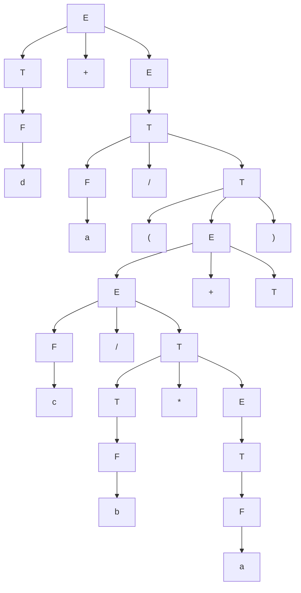

## Numere

N = number (literal)
U = unsigned (without sign)
Z = possibly zero digit
D = non-zero digit
C = sequence of digits

$ G = (V_T, V_N, P, S) $

$ V_T = \{ \text{+}, \text{-}, 0, 1, 2, 3, 4, 5, 6, 7, 8, 9 \} $

$ V_N = \{ N, U, Z, G \} $

$ S = N $

$ P $

1. $ N \rightarrow U $
2. $ N \rightarrow +U $
3. $ N \rightarrow -U $
4. $ N \rightarrow 0 $
5. $ U \rightarrow D $
6. $ U \rightarrow DC $
7. $ C \rightarrow Z $
8. $ C \rightarrow CZ $
9. $ Z \rightarrow 0 $
10. $ Z \rightarrow D $
11. $ D \rightarrow 1 $
12. $ D \rightarrow 2 $
13. $ D \rightarrow 3 $
14. $ D \rightarrow 4 $
15. $ D \rightarrow 5 $
16. $ D \rightarrow 6 $
17. $ D \rightarrow 7 $
18. $ D \rightarrow 8 $
19. $ D \rightarrow 9 $

$ P =
\begin{cases}
N \rightarrow U|+U|-U|0 \\\\
U \rightarrow D|DC \\\\
C \rightarrow Z|CZ \\\\
Z \rightarrow 0|D \\\\
D \rightarrow 1|2|3|4|5|6|7|8|9 \\\\
\end{cases}
$

$ -2307 $

$ N \rightarrow -U \rightarrow -2C \rightarrow -23C \rightarrow -230C \rightarrow -2307 $

## Expresii aritmetice

$ E = \text{expression} $

$ T = \text{term} $

$ F = \text{factor} $

$ G = (V_T, V_N, P, S) $

$ V_T = \{ \text{+}, \text{-}, \text{*}, \text{/}, \text{(}, \text{)}, a, b, c, d \} $

$ V_N = \{ E, T, F \} $

$ S = E $

$ P $

1. $ E \rightarrow E + T $
2. $ E \rightarrow E - T $
3. $ E \rightarrow T $
4. $ T \rightarrow T * F $
5. $ T \rightarrow T / F $
6. $ T \rightarrow F $
7. $ F \rightarrow (E) $
8. $ F \rightarrow a $
9. $ F \rightarrow b $
10. $ F \rightarrow c $
11. $ F \rightarrow d $

$ (a + b * c / a) / a + d $

$ 
E \xrightarrow{E \rightarrow E + T} E + T \\\\
E + T \xrightarrow{T \rightarrow F} E + F \\\\
E + F \xrightarrow{F \rightarrow d} E + d \\\\
E + d \xrightarrow{E \rightarrow T} T + d \\\\
T + d \xrightarrow{T \rightarrow T / F} T / F + d \\\\
T / F + d \xrightarrow{F \rightarrow a} T / a + d \\\\
T / a + d \xrightarrow{T \rightarrow (E)} (E) / a + d \\\\
(E) / a + d \xrightarrow{E \rightarrow E + T} (E + T) / a + d \\\\
(E + T) / a + d \xrightarrow{T \rightarrow T / F} (E + T / F) / a + d \\\\
(E + T / F) / a + d \xrightarrow{F \rightarrow a} (E + T / a) / a + d \\\\
E + (T / a) / a + d \xrightarrow{T \rightarrow a} (E + T / a) / a + d \\\\
(E + T / a) / a + d \xrightarrow{T \rightarrow T * F} (E + T * F / a) / a + d \\\\
(E + T * F / a) / a + d \xrightarrow{F \rightarrow c} (E + T * c / a) / a + d \\\\
(E + T * c / a) / a + d \xrightarrow{T \rightarrow F} (E + F * c / a) / a + d \\\\
(E + F * c / a) / a + d \xrightarrow{F \rightarrow b} (E + b * c / a) / a + d \\\\
(E + b * c / a) / a + d \xrightarrow{E \rightarrow T} (T + b * c / a) / a + d \\\\
(T + b * c / a) / a + d \xrightarrow{T \rightarrow F} (F + b * c / a) / a + d \\\\
(F + b * c / a) / a + d \xrightarrow{F \rightarrow a} (a + b * c / a) / a + d \\\\
$

